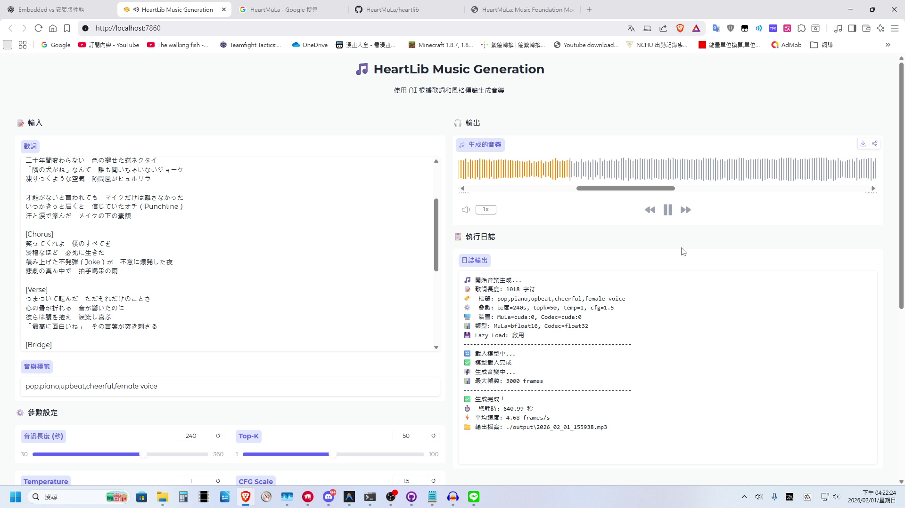

# HeartMuLa-WebUI

使用 Gradio 製作的一個簡易 [HeartMuLa](https://github.com/HeartMuLa/heartlib) 操作 WebUI，附帶一鍵安裝包，可下載後直接使用。



## 🚀 快速開始

### 1. 下載模型

首次使用前，請先下載模型（二擇一）：

```batch
# Hugging Face（國際）
download_models_hf.bat

# ModelScope 魔搭（中國大陸）
download_models_modelscope.bat
```

### 2. 啟動介面

```batch
run_gradio.bat
```

瀏覽器將自動開啟 `http://localhost:7860`

---

## 📁 檔案結構

```
heartlib/
├── 🚀 執行腳本
│   ├── run_gradio.bat              # 啟動 WebUI
│   ├── download_models_hf.bat      # 下載模型 (HuggingFace)
│   └── download_models_modelscope.bat  # 下載模型 (ModelScope)
│
├── 📦 環境
│   ├── python_embeded/             # Python 嵌入式環境
│   └── ffmpeg/bin/                 # FFmpeg（用於音訊處理，若環境變數已有設定可不用放）
│
├── 🤖 模型
│   └── ckpt/
│       ├── HeartMuLa-oss-3B/       # 語言模型
│       └── HeartCodec-oss/         # 音訊編解碼器
│
├── 🎵 輸出
│   └── output/                     # 生成的音樂 (YYYY_MM_DD_HHmmss.mp3)
│
└── 📄 原始碼
    └── gradio_app.py               # Gradio 主程式
```

---

## ⚙️ 參數說明

### 輸入

| 參數 | 說明 |
|------|------|
| **歌詞** | 支援結構標記：`[Intro]`, `[Verse]`, `[Prechorus]`, `[Chorus]`, `[Bridge]`, `[Outro]` |
| **音樂標籤** | 逗號分隔，例如：`pop,rock,piano,upbeat,male voice` |

### 生成參數

| 參數 | 範圍 | 預設 | 說明 |
|------|------|------|------|
| 音訊長度 | 30-360 秒 | 240 | 最大生成長度 |
| Top-K | 1-100 | 50 | 取樣時考慮的候選數量 |
| Temperature | 0.1-2.0 | 1.0 | 隨機性控制（越高越隨機） |
| CFG Scale | 1.0-3.0 | 1.5 | 條件引導強度 |

### 裝置設定

| 參數 | 說明 |
|------|------|
| **MuLa 裝置** | 語言模型運行裝置（建議 GPU） |
| **Codec 裝置** | 編解碼器裝置（建議與 MuLa 相同） |
| **MuLa 資料類型** | `bfloat16`（推薦）效能佳、記憶體低 |
| **Codec 資料類型** | `float32`（推薦）確保音質 |
| **Lazy Load** | 若VRAM夠大，`False` 速度較快，`True` 時節省記憶體 |

---

## 💡 使用建議

### GPU 記憶體需求

| 配置 | 最低 VRAM |
|------|----------|
| Lazy Load = False | ~16 GB |
| Lazy Load = True | 8~12 GB |

### 效能優化

1. **Lazy Load = False**：模型常駐記憶體，連續生成較快
2. **使用 bfloat16**：比 float32 快且省記憶體
3. **Codec 使用 float32**：避免音質損失

---

## FFmpeg

FFmpeg 須使用 Shared 版本的二進位檔(如: `ffmpeg-release-full-shared.7z`)，才可以被函式庫呼叫使用。

> 下載連結: https://www.gyan.dev/ffmpeg/builds/#release-builds

將下載好的 FFmpeg 二進位檔解壓縮到 `HeartMuLa-WebUI/ffmpeg`，即可，程式會自動偵測並使用，並非一定要設定環境變數。

---

## 📝 授權

本UI基於 Apache 2.0 協議授權，詳情請查看 [LICENSE](LICENSE)

HeartMuLa 專案本體請參閱 [HeartMuLa](https://github.com/HeartMuLa/heartlib) LICENSE 檔案。
