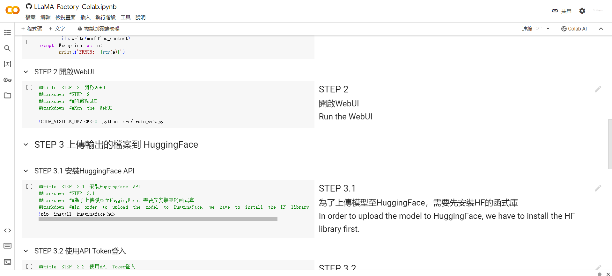

## 專案用途

簡單寫一個 Colab 記事本，可能不完美，但至少能用(免費版 Colab 要注意可能爆系統 RAM)

[https://colab.research.google.com/github/ADT109119/LLaMA-Factory-Colab/blob/main/LLaMA-Factory-Colab.ipynb](https://colab.research.google.com/github/ADT109119/LLaMA-Factory-Colab/blob/main/LLaMA-Factory-Colab.ipynb)