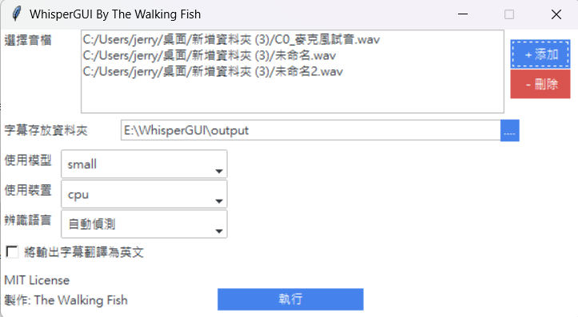
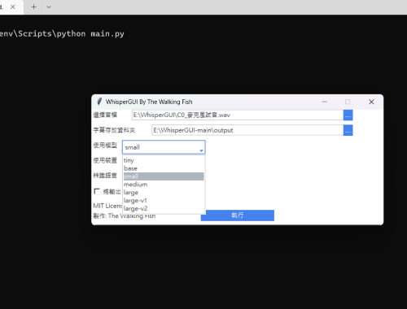
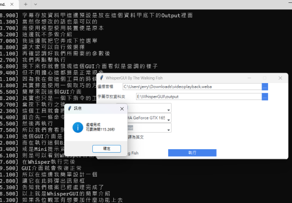

> 此專案是我用 2 個小時簡單製作的 WhisperGUI+快速安裝包，可以讓我們在使用 Whisper 時快速操作，無須打指令，以及讓懶得手動裝一堆東西的人可以快速的使用 (Python 以及 FFmpeg 還是要自己裝)。

[OpenAI Whisper](https://github.com/openai/whisper)

## 專案用途

此專案的作用

在於方便大家可以快速設定好的 Whisper 執行環境

以及讓多數使用者

可以僅需透過此 GUI 介面操作使用

而無須打指令

## 功能

目前支援操作以下幾種 Whisper 的功能

1. 選擇音檔
2. 選擇輸出資料夾
3. 選擇使用模型
4. 選擇辨識語言
5. 選擇使用裝置 (CPU、指定顯卡)
6. 將字幕翻為英文

## 畫面

> 操作示意 選擇檔案 > 選擇跑模型的裝置 > 執行完成





## 安裝

> 請先自行安裝 Python 3.7 以上版本，以及 FFmpeg

以下將會引導你如何在你的電腦上執行此專案。

### 取得專案

```bash
git clone git@github.com/ADT109119/WhisperGUI.git
```

**或是直接在 GitHub 頁面點 Download ZIP**

### 確認電腦已有 Pyhton 以及 FFmpeg

```bash
python --version
ffmpeg -version
```

### 執行 setup.bat

請直接執行資料夾中的 setup.bat，等待虛擬環境完成設置

### 執行專案

請直接執行資料夾中的 run.bat，若無報錯，將可以看到 GUI 介面

## 資料夾說明

- model - 模型存放處
- output - 預設輸出資料夾
- venv - 虛擬環境資料夾
...

## 專案技術

- Python
- tkinter
- ttkbootstrap

## 聯絡作者

你可以透過以下方式與我聯絡

- [Email: 2.jerry32262686@gmail.com](mailto:2.jerry32262686@gmail.com)
...

## License

This project is under the MIT License. See [LICENSE](https://github.com/ADT109119/WhisperGUI/blob/main/LICENSE) for further details.