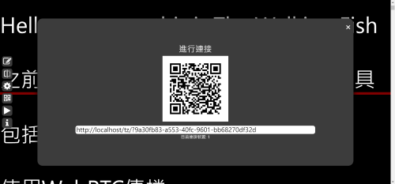
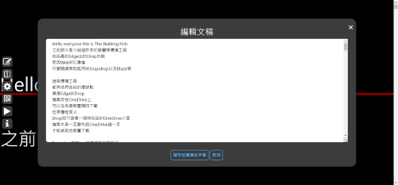
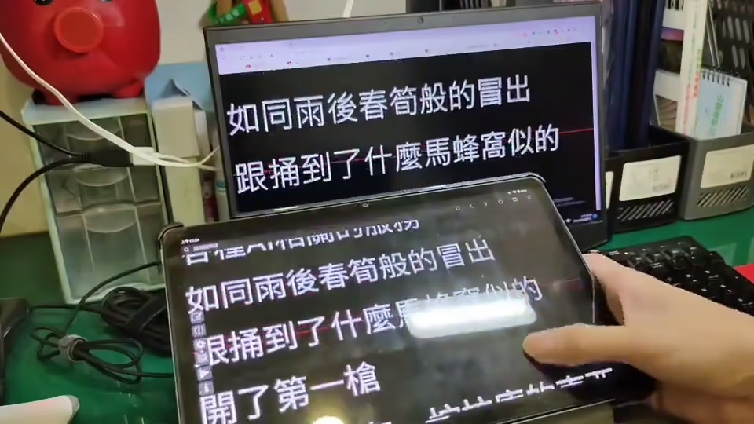

> 此專案為網頁程式，並使用 PeerJs 來做 P2P 資料傳輸，無需將文稿儲存於任何伺服器上

專案網址: [https://adt109119.github.io/remoteMultideviceTeleprompter/](https://adt109119.github.io/remoteMultideviceTeleprompter/)

## 專案用途

此專案為一網頁程式

使用 PeerJs 來做 P2P 資料傳輸

目的在於提供使用者一個網頁

僅需開啟網頁然後掃 QR Code

便可以利用手上的裝置

實現提詞機的功能

且支援裝置間互相控制

讓所有裝置都可顯示相同的畫面、在相同文稿位置

使用其中一台裝置

便可操縱所有裝置

方便遠距進行調整

## 功能

目前支援以下幾種功能

1. 廣播文稿
2. 左右鏡射
3. 文稿位置操縱
4. 統一設定文字大小、間距、邊距
5. 自動捲動

## 畫面

> 操作示意 裝置連線 > 廣播文稿 > 裝置操控

## 專案技術

- [PeerJs](https://peerjs.com/)
- HTML
- CSS
- JavaScript

## 聯絡作者

你可以透過以下方式與我聯絡

- [Email: 2.jerry32262686@gmail.com](mailto:2.jerry32262686@gmail.com)
...