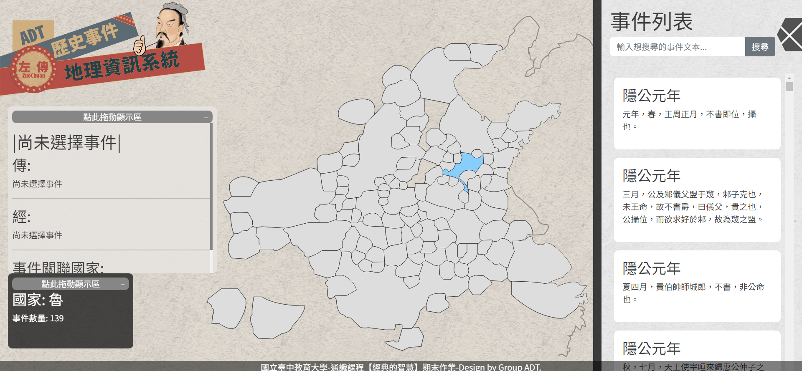
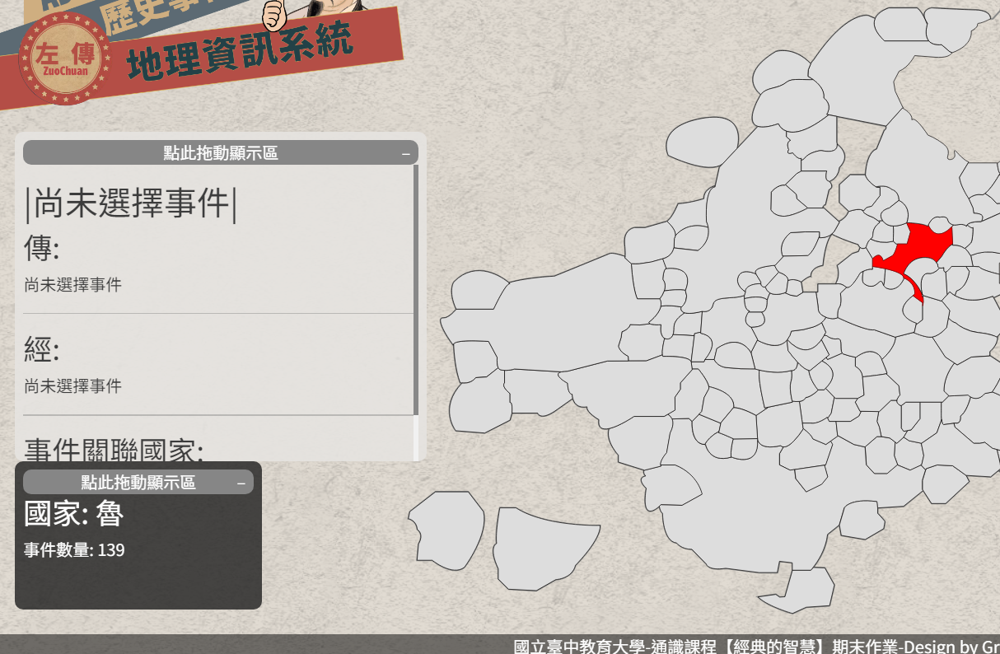
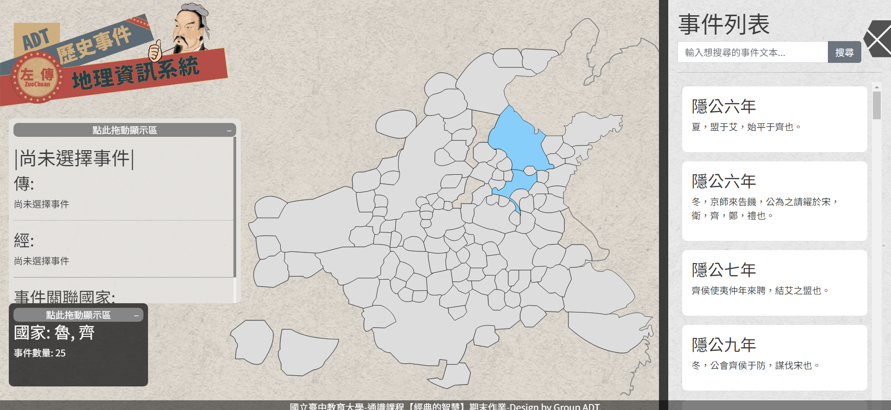

## 專案用途

網頁功能為利用左傳的段落，查詢該段落相關聯的國家

亦或是選取一個或多個國家，顯示選取國家有參與的事件

## 目前專案功能及進度

目前支援以下幾種功能:

- [x] 游標 hover 可顯示國家名稱及其相關事件數量
- [x] 多選國家查詢相關事件
- [x] 點選事件顯示顯示相關國家
- [x] 查詢左傳內文

尚待完成:

- [ ] 加入時間條，調整時間讓地圖變化
- [ ] 加入更多章節 (目前僅到僖公，若要繼續，須先完成上一項)

## 畫面

> 操作示意  
> 游標移至國家上顯示國家名稱以及關聯事件數量 > 選取國家右側會顯示事件列表 (可選多個國家) > 搜尋左傳、春秋段落內容以及年代

## 專案技術

- HTML
- CSS
- JavaScript
- Bootstrap
- Web Worker

## 聯絡作者

你可以透過以下方式與我聯絡

- [Email: 2.jerry32262686@gmail.com](mailto:2.jerry32262686@gmail.com)
...