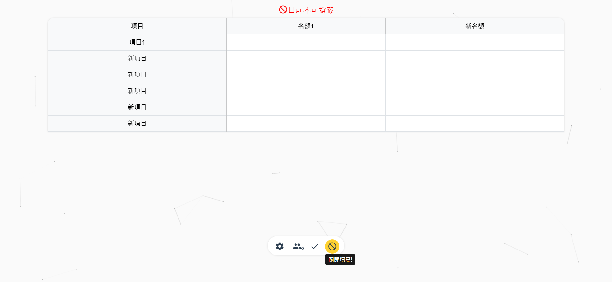
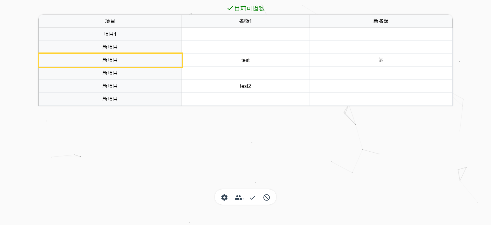

# draw_topic

簡單寫的一個搶籤工具，使用PeerJS連線，方便隨時開房間、設定主題，讓大家搶籤。(僅花兩天的時間隨便做做，介面與功能都待完善)

[https://adt109119.github.io/draw_topic/](https://adt109119.github.io/draw_topic/)


## 專案用途

此專案提供一個可以簡單開創建一個搶籤房間的工具，房主只需要設定需要的行列數，在設定項目名稱，便可以讓使用者加入，準備搶籤。

## 目前專案功能及進度

目前支援以下幾種功能:

- [x] 設定行列數
- [x] 設定每列的名稱
- [x] 顯示使用者
- [x] 設定目前是否允許搶籤
- [x] 快速創建/加入房間
- [x] 匯出CSV
- [x] 顯示當前房間QR Code

尚待完成:

- [ ] 設定每個用戶可搶數量(目前全部限制只能搶一個)
- [ ] 匯入CSV

## 畫面

> 操作示意 創建/加入房間>可關閉填寫，等到人都加入後再開啟>點選選項搶簽





## 專案技術

- Vue
- PeerJS
- HTML
- CSS
- JavaScript

## 聯絡作者

你可以透過以下方式與我聯絡

- [Email: 2.jerry32262686@gmail.com](mailto:2.jerry32262686@gmail.com)
...

## Project setup

```
npm install
```

### Compiles and hot-reloads for development

```
npm run serve
```

### Compiles and minifies for production

```
npm run build
```

### Lints and fixes files

```
npm run lint
```

### Customize configuration

See [Configuration Reference](https://cli.vuejs.org/config/).