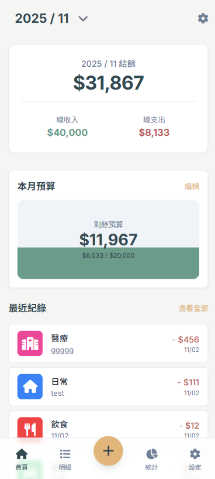
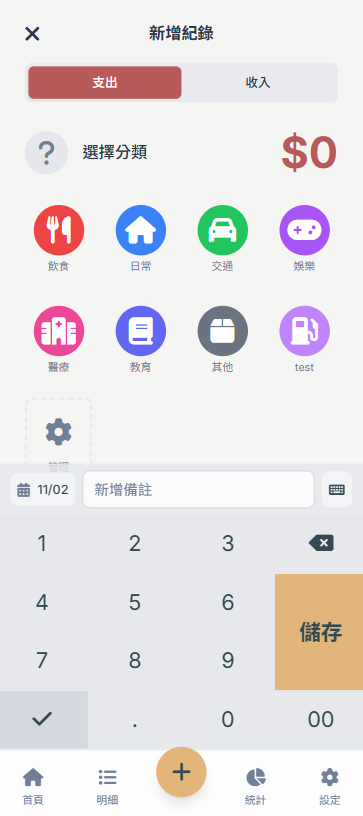
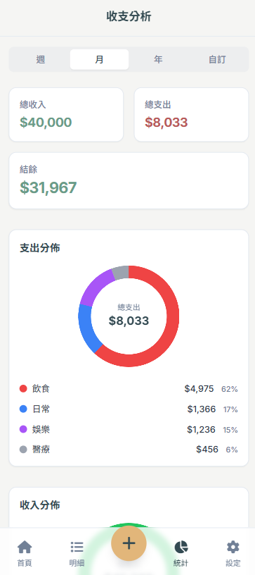

# 輕鬆記帳 2.0 - 現代化 PWA

這是「輕鬆記帳」應用程式的現代化版本，採用最新的前端技術重新打造，旨在提供更美觀、更易用、更穩健的記帳體驗。


📋 **[查看完整更新日誌](CHANGE_LOG.md)** - 了解所有版本的詳細更新內容

|  |  | 
|------|------|------|

## 🚀 新功能特色與 UI/UX 改進

### ✨ 全新設計與視覺效果
- **現代化 UI**: 採用 Tailwind CSS 打造的簡潔美觀介面，並使用漸層背景增添視覺層次。
- **響應式設計**: 完美適配手機、平板和桌面裝置，確保在不同裝置上都有一致且良好的視覺體驗。
- **流暢動畫**: 豐富的互動動畫提升使用體驗，例如分類按鈕的選中效果、滑動切換頁面等。
- **圖標顯示與顏色**: 整合 Font Awesome 6，所有圖標風格統一且清晰。分類按鈕支援自定義顏色，並有明確的選中狀態視覺回饋。

### 📊 強化功能
- **資料視覺化**: 使用 Chart.js 提供圓餅圖（支出分類）和水位圖（預算管理），讓使用者能直觀地分析收支狀況。
- **智能統計**: 多維度收支分析和分類統計，首頁快速統計功能移至最上方，方便用戶快速概覽。
- **記錄管理**: 完整的增刪改查功能，記錄明細間距修復，同日記錄顯示更清晰。
- **每月預算設定**: 可設定每月支出預算，水位圖動態顯示預算使用情況，並有超支警告。
- **自定義分類**: 完整的分類管理功能，可新增自定義分類、選擇圖示和顏色，並與預設分類無縫整合。
- **共用日期選擇器**: 將明細與統計頁面的日期選擇 Modal 變為共用元件，解決先前統計頁面日期選擇異常的問題，並確保了介面體驗的一致性。
- **滑動手勢功能**: 首頁支援左右滑動切換支出分類和預算管理，實時跟隨手指移動，同時支援標籤點擊和圓點指示器。智能手勢識別，不會干擾頁面垂直滾動。
- **資料匯出入**: 支援完整的資料匯出和匯入功能，向下相容舊版資料格式，提供安全的資料備份和遷移。
- **PWA 更新機制**: 智能版本控制和自動更新提示，解決 PWA 快取問題，確保用戶始終使用最新版本。
- **PWA 管理功能**: 設定頁面新增「強制更新」、「分享 App」、「安裝為應用程式」等功能，提升 PWA 使用體驗。
- **版本管理**: 設定頁面顯示當前版本號和最後更新時間，支援手動檢查更新功能。
- **完整更新日誌**: 內建版本更新日誌系統，可查看所有歷史版本的詳細更新記錄。
- **可摺疊介面**: 記帳頁面的小鍵盤支援最小化功能，整個標題列都可點擊切換，緊湊設計節省螢幕空間。
- **智能導覽**: 底部導覽優化為首頁、記帳、明細三大功能，統計功能整合至首頁便於快速訪問。
- **詳細記錄管理**: 完整的記錄編輯功能，支援修改類型、分類、金額、說明和日期。
- **視覺化增強**: 支出分類甜甜圈圖中央顯示總額，提供直觀的支出概覽。
- **自訂分類功能**: 支援自訂圖標輸入，可使用任何 Font Awesome 圖標類別創建個性化分類。
- **雲端備份與同步**: 整合 Google Drive，支援自動備份與多裝置間的資料同步，確保資料安全且隨處可用。
- **優化輸入體驗**: 記帳面板緊湊設計，日期輸入帶標籤，類別選擇使用統一的綠色主題效果。

### 🧭 導覽系統
- **底部導覽列**: 優化的五欄式導覽，包含「首頁 (🏠)」、「明細 (📋)」、「記帳 (➕)」、「統計 (📊)」、「設定 (⚙️)」，核心功能一鍵直達。
- **設定頁面**: 整合了資料管理、應用程式管理與版本資訊，提供一站式的功能操作。

### 📱 用戶介面改進
- **可摺疊小鍵盤**: 記帳頁面的數字鍵盤支援最小化功能
- **緊湊輸入面板**: 記帳輸入區域空間優化
- **視覺化數據**: 支出分析圖表增強
- **類別選擇優化**: 統一的視覺回饋系統
- **自訂分類功能**: 完整的分類自訂能力
- **記錄編輯功能**: 詳細記錄頁面的完整編輯能力
- **設定頁面增強**: 重新設計的設定介面

## 🛠️ 技術升級與開發環境

### 核心技術棧
- **前端框架**: 原生 HTML/CSS/JS，無任何框架。
- **CSS 框架**: Tailwind CSS，提供原子化的 class，客製化彈性高。
- **圖表庫**: Chart.js，用於資料視覺化。
- **圖標庫**: Font Awesome 6。
- **資料儲存**: 從 `localStorage` 升級到 `IndexedDB`，提供更強大的非同步儲存和查詢能力。

### 開發工具
- **建置工具**: Vite，提供快速的開發伺服器和建置功能。
- **程式碼品質**: ESLint 進行程式碼檢查。
- **程式碼格式化**: Prettier 統一程式碼風格。

### 專案結構
```
輕鬆記帳/
├── src/                    # 源碼目錄
│   ├── js/                # JavaScript 模組
│   ├── css/               # 樣式檔案
│   └── index.html         # 開發用 HTML
├── public/                # 公共資源
├── icon/                  # 圖示檔案
├── package.json           # 專案配置
├── vite.config.js         # Vite 配置
└── index.html             # 入口檔案
```

## 🔄 資料遷移

新版本會自動檢測並遷移舊版本的資料：
1.  檢測 `localStorage` 中的 `AllTheData`。
2.  自動轉換格式並匯入 `IndexedDB`。
3.  備份原始資料為 `AllTheData_backup`。
4.  清除舊的 `localStorage` 資料。

## 📥📤 資料管理

### 資料匯出功能
- **一鍵匯出**：點擊首頁右上角設定按鈕 → 匯出資料
- **格式支援**：JSON 格式，包含完整的記帳記錄和元數據
- **資料完整性**：包含版本資訊、匯出日期、記錄總數等元數據

### 資料匯入功能
- **向後相容**：完全支援舊版資料格式自動轉換
- **格式檢測**：自動識別新版和舊版資料格式
- **資料驗證**：匯入前驗證資料完整性，過濾無效記錄
- **安全確認**：匯入前會提示確認是否覆蓋現有資料

### 版本管理功能
- **版本資訊顯示**：設定頁面顯示當前應用程式版本號和最後更新時間
- **手動檢查更新**：點擊「檢查更新」按鈕主動檢查新版本
- **更新狀態提示**：智能識別並提示不同的更新狀態

## 🔄 PWA 更新機制

### 智能版本控制
- **自動檢測**：應用程式會自動檢測新版本的可用性
- **版本管理**：使用語義化版本號（如 v2.1.0.2）進行版本控制
- **快取策略**：採用多層快取策略確保更新的可靠性

### 更新流程
1. **檢測更新**：當有新版本時，會自動在背景下載
2. **用戶通知**：顯示藍色更新橫幅提示新版本可用
3. **選擇更新**：用戶可選擇「立即更新」或「稍後更新」
4. **自動重載**：更新完成後自動重新載入頁面使用新版本

### 安裝與分享
- **安裝提示**: 「設定」頁面提供「安裝為應用程式」按鈕，引導用戶將網站安裝為 PWA，此按鈕在安裝後會自動隱藏。
- **應用分享**: 「設定」頁面提供「分享此 App」按鈕，方便用戶透過原生分享功能推薦給朋友。

### 快取管理
- **版本化快取**：每個版本使用獨立的快取空間
- **自動清理**：更新時自動清除舊版本快取
- **智能策略**：網路優先、快取優先、離線支援

### 開發者更新指南
發布新版本時只需：
1. 修改 `public/serviceWorker.js` 中的 `APP_VERSION`
2. 部署應用程式
3. 用戶訪問時會自動檢測並提示更新

## 📈 未來規劃

- [x] 雲端同步功能
- [x] 多帳戶支援
-   深色模式
-   多語言支援
-   推送通知
-   更多圖表類型

## 🤝 貢獻

歡迎提交 Issue 和 Pull Request 來改善這個專案！

## 📄 授權

MIT License

---

**輕鬆記帳 2.0** - 讓記帳變得更簡單、更美觀、更智能！
